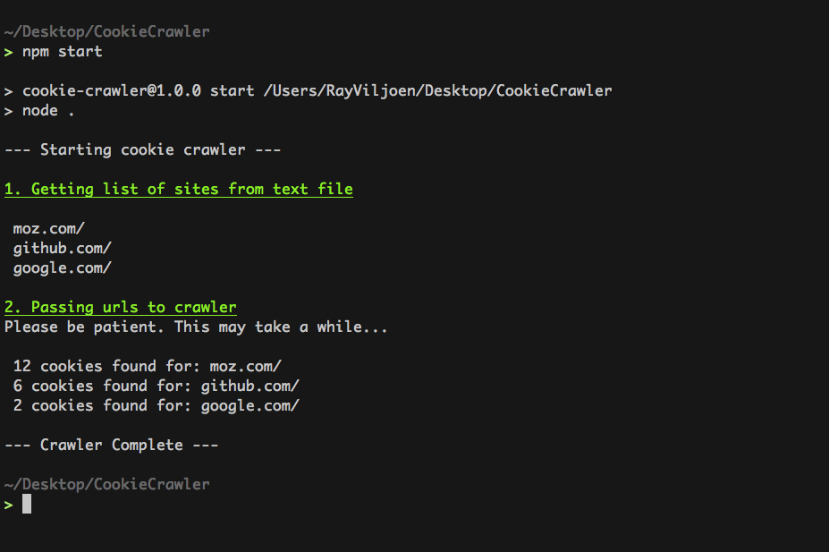

# CookieCrawler

---

Node CLI utility for retrieving cookie information from multiple sites.

##Installation

1. Clone repo
2. Run `npm i` to install dependancies
3. Add sites to `sites.txt`.
    - Plain txt file with each line containing a site.
    - Each url must be added individually. eg: domain.com/login
4. Check `config.json`, although defaults should be fine.
5. Run `npm start` to start the tool.
    - This may take a while to complete as each url is loaded with all it's assets.
6. If everything worked the results will be available in `cookies.csv` (or whatever name was set in config).

**Example results**

###TODO:
  - Add support for more input types.
  - Tests
